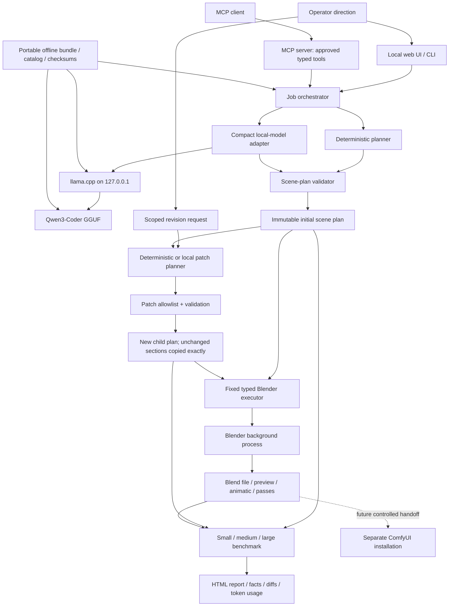

# 3D Auto system schema



## Data boundary

The source of truth is JSON data, never generated code. A complete job lineage is:

```text
request -> scene-plan -> preview/render -> scoped revision request
        -> minimal patch -> child scene-plan -> preview/render -> checks
```

Every child is written to a new directory and names its parent. Applying a patch may change only approved top-level sections or a named object. Application code copies all other sections exactly and validates the complete child plan again before Blender sees it.

## Planned MCP surface

The MCP server is a thin interface over the same orchestrator. Its proposed tools are:

| Tool | Purpose |
|---|---|
| `project.readiness` | Report Blender, local model, GPU, bundle, and configuration status. |
| `scene.create` | Create a new immutable request and validated scene plan. |
| `scene.revise` | Create a child plan from a scoped natural-language change. |
| `scene.get_plan` | Read one retained plan. |
| `scene.diff` | Compare a parent and child by scene section. |
| `scene.render_preview` | Render one low-cost still into a new output directory. |
| `scene.render_animatic` | Render the validated timeline into a new output directory. |
| `job.list` | List retained jobs and lineage. |
| `job.get_artifacts` | Return paths and metadata for retained outputs. |
| `benchmark.run` | Run small, medium, large, or all comparison cases. |
| `benchmark.get_report` | Return facts, failures, previews, and token usage. |

The MCP layer has no general shell, Python execution, arbitrary file-write, overwrite, move, delete, or cleanup tool. It accepts typed parameters and delegates to the same validation and preservation code used by the UI and CLI.

## Token budget strategy

- Initial planning sends one compact fixed schema instruction and one scene request.
- Revisions send only the editable scene sections plus the requested change.
- Model responses contain JSON only and use deterministic temperature zero.
- Small, medium, and large cases cap completion budgets at 800, 1,400, and 2,200 tokens.
- Every response records reported prompt and completion tokens for comparison.
- Blender rendering, validators, diffs, reports, and deterministic tests use no model tokens.
